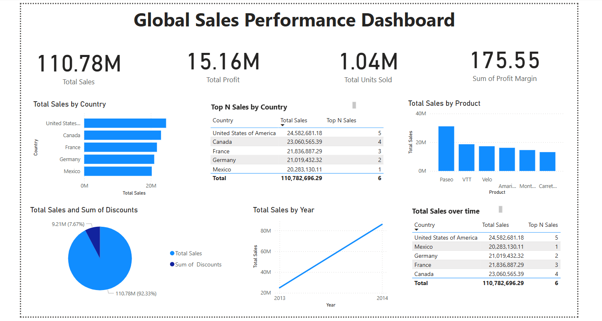

# Global Finance and Sales Performance Dashboard

### Author: **Vaishnavi Patil**

An interactive **Power BI dashboard** analyzing global sales performance and profitability.  
Built using **SQL**, **Power Query**, and **DAX** to transform raw data into clear business insights.

---

## Overview
This project explores global sales trends, profit performance, and product-level insights.  
The analysis helps identify top-performing markets, discount impacts, and seasonal growth patterns.

---

## Tools Used
- Power BI  
- SQL  
- DAX  
- Power Query  
- Excel  

---

## Files in This Repository
| File | Description |
|------|--------------|
| `sales_dashboard.pbix` | Power BI dashboard file |
| `dashboard_preview.png` | Dashboard screenshot shown below |
| `data_cleaning.sql` | SQL script used for cleaning and integrating data |
| `dataset.xlsx` | Raw Global Superstore dataset |
| `report.pdf` | PDF summary of insights |

---

## Dashboard Preview

---

## Key Insights
- **US & Canada** contribute over 65% of global sales.  
- **Germany & France** show margin declines due to high discounting.  
- Product **Paseo** leads global sales revenue.  
- Consistent performance spikes observed in **Q2**, suggesting seasonal trends.  

---

## Skills Highlighted
**Data Cleaning** | **ETL** | **Data Modeling** | **Visualization** | **Business Intelligence**

